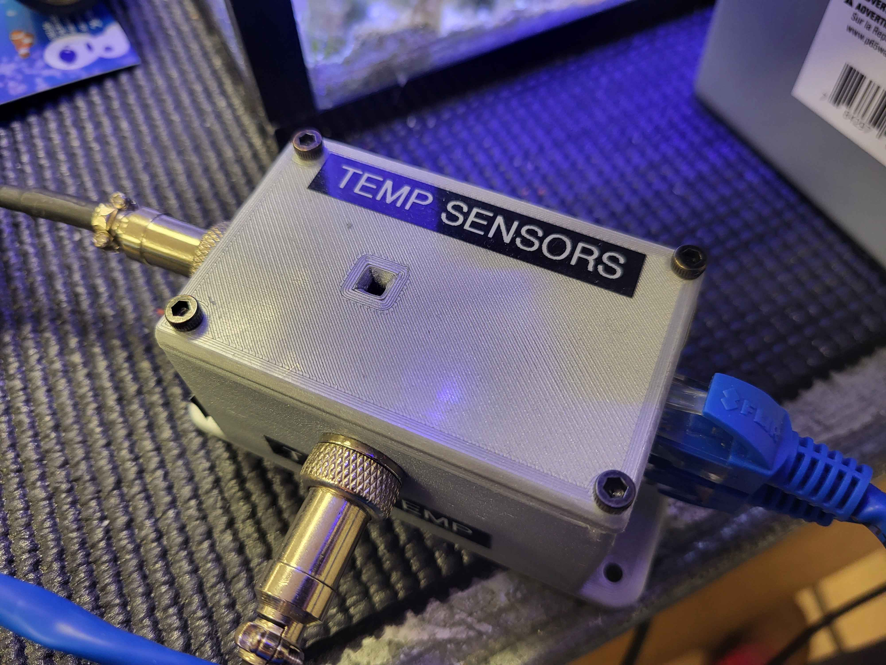
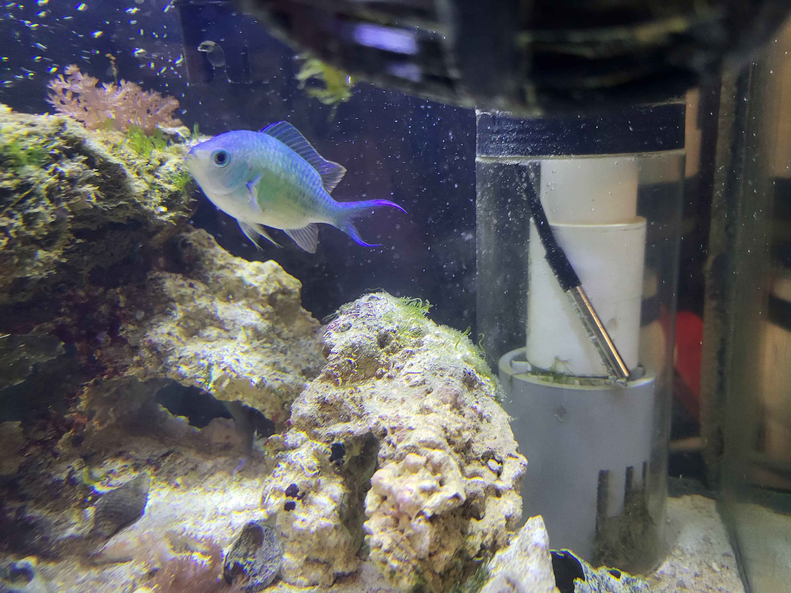
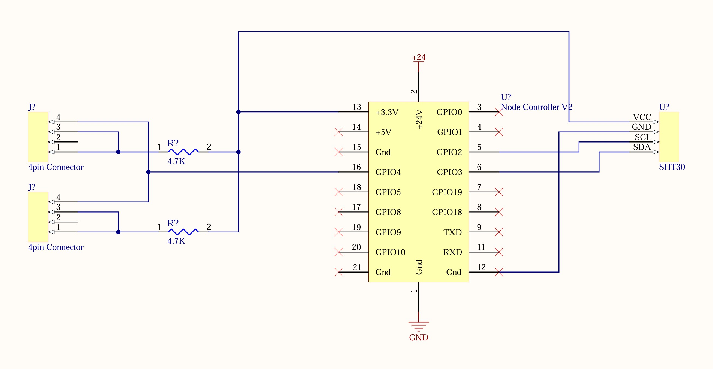

# Device-TemperatureHumiditySensor
A device that monitors water and air temperature and humidity. The has connections for two water temperature probes. Also it contains ambient air and humidity sensor located in the node enclosure.

## Hardware

The two water temperature probes are DS18B20. The ambient sensor is a SHT30.

## Firmware

### Message IDs and Format

| Parameter | Message ID | Data Format |
| --------- | ---------- | ----------- |
| Ambient Temp | 0x0A00 | 32bit float
| Ambient Temp Alarm | 0x0A01 | bool on/off
| Ambient Temp Alarm Low | 0x0A02 | int
| Ambient Temp Alarm High | 0x0A03 | int
| Ambient Humidity | 0x0A04 | 32bit float
| Ambient Humidity Alarm | 0x0A05 | bool on/off
| Ambient Humidity Alarm Low | 0x0A06 | int
| Ambient Humidity Alarm High | 0x0A07 | int
| Tank Temp | 0x0A08 | 32bit float
| Tank Temp Alarm | 0x0A09 | bool on/ff
| Tank Temp Alarm Low | 0x0A0A | int
| Tank Temp Alarm High | 0x0A0B | int
| Sump Temp | 0x0A0C | 32bit float
| Sump Temp Alarm | 0x0A0D | bool on/ff
| Sump Temp Alarm Low | 0x0A0E | int
| Sump Temp Alarm High | 0x0A0F | int

